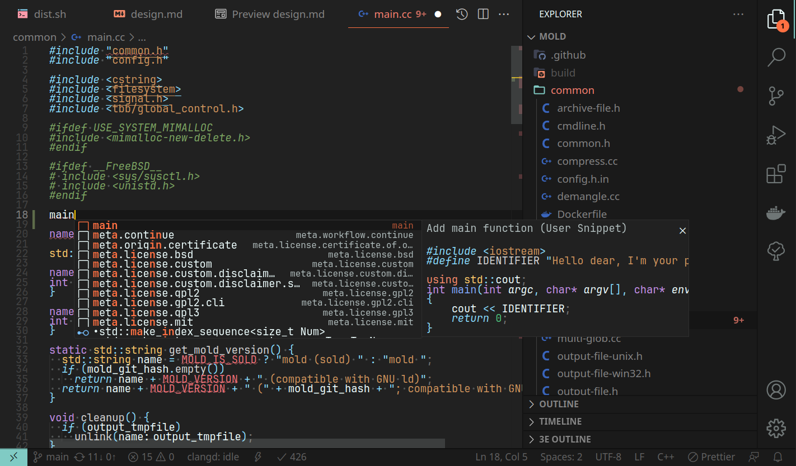

## Hinell - VS Code files



### FAQ
- **Q**: Why not to use built-in function for sync-ing?
</br>**A**: No way to version files.


## Install Windows 


```sh
cd 'C://Users/${USERNAME}/Application Data/Code'
git init --initial-branch=main
git remote add origin git@github.com:hinell/vscode.git
git fetch --no-tags --depth 1 origin
git reset --hard origin/main
```

## Install Linux systems (Debian/Ubuntu)
GNU `stow`  is required. 

```bash
    cd vscode/
    stow .
```
### Development note
When creating a new snippet file in `User/snippets/` subfolder dont' forget to run 
```sh
cd ~/.dotfiles/vscode/
stow  .
```
Otherwise it won't be linked to the VS Code system user configs in the `~/.config/Code` 


You may link `User/` folder manually, but this is not advised, cause stow would link subfiles recursively, keeping original `User/` folder intact.

----
> Sep 26, 2022 +0300<br/>
> August 23, 2023
